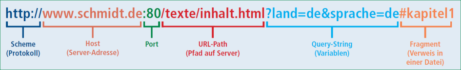

# JS Grundlagen 
## Numbers
Zahlen/Number sind wie doubles in java 64 bit floating point nummern, sie enthalten alle 32bit Ganzzahlen und können deshalb alle int exakt darstellen.\
Zusätzlich gibt es noch den **Bigint** was eine grössere Zahl ist. Keine automatische Typenumwandlung von/zu Number
```javascript
//Number
17              //int
3.14            //floating oint
2.99e8          // x * 10^8
1/0             // Infinity
Infinity + 1    // Infinity
0/0             // NaN 
//Bigint
1n + 2n         // 3n Bigint 
Number(1n)      // 1
```


## Typeof
Der typeof operator liefter den Typstring seines Operanden
```javascript
typeof 12       // 'number'
typeof(12)      // 'number
typeof 2n       // 'bigint'
typeof Infinty  // 'number'
typeof NaN      // 'number' !!
typeof 'number' // 'string'
```


## Strings
Sequenz von 16-Bit-Unicode-Zeichen. Konkatination mit ```+```-Operator:\
```'con' + 'cat' + 'enate'```
### Template-Strings
Strings die durch 2 Backticks definiert sind \`...\` in \ wird als \ interpretiert nicht start einer Escape-sequenz.
```javascript
`half of 100 is ${100 / 2}`             // 'half of 100 is 50'
`erste Zeile                    
zweite Zeile`                           //erste Zeile\nzeite Zeile
'some text with %d %s',2,'parameters'   //-> some text with 2 parameters
```

## Logische Ausdrücke
Typ **boolean** bit den werten **true** und **false**
```javascript
typeof true         // 'boolean'
3>4                 // true
1<2 && 2<3          // ture
4>= 5 || !(1 == 2)  // true
"ab" == "a" + "b"   // true  
```

## Spezielle Werte 
Zwei spezielle Werte: ``null`` und ``undefined``\
Stehen für die Abwesenheit eines konkreten Wertes. Nicht vorhandene Objektreferenzen ergeben eher ``null`` sind aber eigentlich austauschbar
```javascript
null         // null
undefined    // undefined

let wert
wert         // undefined
```
## Dynamisches Typenkonzept 
Typen werden bei Bedarf automatisch konbertiert was zu unerwarteten Effekten führen kann.
```javascript
8 * null            // 0
"5" - 1             // 4
"5" + 1             // 51
null == undefined   // true
[!0, !0n, !"", !false, !undefined, !null, !NaN ]
//[ true, true, true, true, true, true, true ]
```

## Vergleiche == / ===
* == Vergleicht die Referenzen **abstract comparison**
* === Vergleicht den inhalt **straict comparison**
* == Vergleich mit automatischer Typenkonvertierung
* === Vergleich ohne Typenkonvertierung (oft vorzuziehen)
* Ebenso != und !==


```javascript
12 =="12"   // true
12 ==="12"  // false
12 !="12"   // false
12 !=="12"  // true
undefined == null     // true
undefined === null    // false
""== false            // true
""=== false           // false

const a = [1,2,3]
const b = [1,2,3]
const c = a
a == b  // false 
a == c  // true
c[0]= 99
a       // [99,2,3]

[[]==[], {}=={}, (()=>{})==(()=>{})]
//[false, false, false]
[3.5 == 3.5, "abc"=="abc", false==false]
//[true, true, true]
```

## Logische Operatoren
```javascript
null || "user"          // "user"
"Agnes" || "user"       // "Agnes"
1 && 1                  // f1
1 > 2 ? "eins" : "zwei" // "zwei"
```

## Variablen definieren 
Verbotene namen: *case, class, if ,while....*
```javascript 
var a = 0 // veraltet 
let b = 1 // zu bevorzugen 
const c = 2 // wenn variable nicht neu referenziert wird
```

# Closures
Funktionen die eine Funktion als rückgabewert haben. 
```js
function wrapValue (n) {
    let local = n
    let func = () => local
    return func
}

let wrap1 = wrapValue(1)
let wrap2 = wrapValue(2)

console.log(wrap1())    // 1
console.log(wrap2())    // 2
```

# Decorator functions
```js
function trace (func) {
    return (...args) => {
        console.log(args)
        return func(...args)
    }
}
// Fakultätsfunktion 
let factorial = (n) => (n<=1) ? 1 : n * factorial(n-1)
// Tracer an Funktion anbringen (trace returned nur die inner funktion)
factorial = trace(factorial)
// Aufruf
console.log(factorial(3))   // [3] -> [2] -> [1]
```

# Funktionen 
* Funktionen sind Objekte
* Funktionen sind Werte. So kann die Bindung an eine Variable immer geändert werden. 
* Man kann ihnen jederzeit Attribute oder Methoden hinzufügen.
* Sie haben bereits vordefinierte Methoden. 

```javascript
// Zuweisung einer anonymen Funktion
const square_v1 = function (x) {
    return x * x
}

// Funktionsdeklaration
function square_v2(x){
    return x * x 
}

// Deklaration über Pfeilnotation 
const square1 = (x) => {return x*x}
const square2 = x => x*x

// Pfeilnotation mit Block
const add = (x,y) => {
    return x + y
}

add.doc = "This function adds two values"
add.doc         // 'This function adds two values'

// Ohne Rückgabe (returns undefinied)
const makeNoise = function(){
     console.log("Pling!")
}
```


## Scope (Gültigkeitsbereich)
```js
let     m = 10  // variable with block scope
const   n = 10  // variable with block scope
var     p = 10  // varibale with function scope
```
**don't use var**

## Globale Variablen 
* Ausserhalb von Funktionen definiert 
* Oder in Funktionen aber `const`,`let`,`var`
```js 
const add = function (a,b) {
    result = a + b
    return result
} 
add(3,4)            // 7
console.log(result) // 7!
```

## Innere Funktion
```js
const humus = function (factor){

    const ingredient = function(amount, unit, name){
        let ingredientAmount = amount * factor
        console.log(`${ingredientAmount} ${unit} ${name}`)
    }
    ingredient(1, "can", "chickpeas")
}
```

## Parameter 
* Anzahl Parameter muss nicht mit der Anzahl beim Aufruf übergebener Argumente übereinstimmen fehlende paramter sind `undefined`

### Default-Paramter
Falls exponent undefined ist wird der Default eingesetzt
```js
function power(base, exponent=2){
    //do exponential stuff
}
```

### Rest-Parameter
* Übergebene Argumente in Array verfügbar. 
* Vorher können normale Paramter stehen
```js
function max(...numbers){
    for(let number of numbers){
        //fancy compare
    }
    return result
}
```
## Spread Operator 
* Spread Operator `...`
* Fügt den Array-Inhalt in die Parameterliste ein

```js
let numbers = [5,1,7]
console.log(max(numbers))        // NaN
console.log(max(...numbers))     // 7
console.log(max(9,...numbers,2)) // 9
```


# Objekte und Arrays 
* **Objekte**: Werte zu einheiten zusammenfassen.
* **Arrays**: Objekte mit sepziellen Eigenschaften.

| Was             | Objekt              | Array              |
|-----------------|---------------------|--------------------|
| Art             | Attribut-Wert-Paare | Sequenz von Werten |
| Literalnotation | werte = {a:1,b:2}   | liste = [1,2,3]    |
| Ohne Inhalt     | werte = {}          | liste = []         |
| Elementzugriff  | werte.a             | liste[0]           |


## Objektliterale 
```javascript
let person = {
    name: "John Baker",
    age: 23,
    "exam results": [5,5.5,5,6]
}

person.age             // 23
person.exam results    // funktioniert nicht muss wie unten 
person["exam results"] // [5,5.5,5,6]

// anhängen von Attributen 
person.ocupation = "smith"
person                 // {...., ocupation: "smith"}
person.attr            // undefined

// entfernen von Attributen 
delete person.occupation
"age" in person // true ( mit in kann überprüft werden ob ein Attr exisitiert)
"age" in person ? delete person.age : "" // Löscht age

// Objekte können auch methoden enthalten
let cat = {type:"cat", sayHello: ( ) => "Miau"}
cat.sayHello    // [Function: sayHello]
cat.sayHello()  // 'Miau'
``` 
### Otional Chaining 
```javascript 
const adventurer = {
    name: "Alice",
    cat: {name: cheshire}
}
console.log(adventurer.dog.name)     // TypeError
console.log(adventurer.dog && adventurer.dog.name) // undefined
console.log(adventurer.dog?.name)    // undefined
console.log(adventurer.cat.name)     // "cheshire"
```

## Objekte analysieren
Methode **keys** und **values** lifern ein Array aller keys oder values
```javascript
let obj = {a: 1, b: 2};
Object.keys(obj)    // [ 'a','b' ]
Object.values(obj)  // [ 1, 2 ]
```

## Objekte Dekonstruieren
Teile aus (möglicherweise grossen) Objekten extrahieren
```javascript
let obj = {foo: 12, bar: "ligma", baz: 43}
let{foo} = obj
let{bar,baz} = obj
console.log(foo) // 12
```
## Vordefinierte Objekte

### String 
* Strings sind in JS ein primitiver datentyp.
* Kann auf 3 Arten definiert werden. ``"..."``,``'...'``,`...`(backticks `)
* String-Methoden sind in String.prototype definiert\
**String methoden:**
  * `slice` Ausschnit aus einem String
  * `*indexOf` Position eines Substirngs
  * `trim` Whitespace am Anfang und Ende entfernen
  * `padStart` vorne Auffüllen bis zu einer bestimmten länge
  * `split` Auftrennen, liefert Array von Strings.
  * `join` Array von Strings zusammenfügen
  * `repeat` Strign mehrfach wiederholen 

### Math
* Methoden und Konstanten als Attribute des `Math`-Objekts
```js
Math.E                  // 2.71828..
Math.min(5,2,-1,12)     // -4
Math.random()           // 0-0.999
```

### Date
```js
let now = new Date()    // 2021-09-02T12:51:34.428Z
now.getHours()          // 1630590694428
now.getYear()           // 121
now.getFullYear()       // 2021
now.toString()          // 
now.toString()        //'Thu Sep 02 2021 15:51:34 GMT+0200 (Mitteleuropäische Sommerzeit)'
```

# This
* **this** ist das Objekt, über das die Methode aufgerufen wird.\
* **Das gilt nicht für Funktionen in Pfeilnotation**
* Bezieht sich immer auf das aktuelle Objekt
* Dies ist aber nicht immer Eindeutig 
```javascript 
let cat = {type:"cat", sayHello: function(){return "Miau aus " + this.type}}
cat.sayHello() // 'Miau aus cat'
let cat = {type:"cat"}
cat.sayHello = () => "Miau aus " + this.type
cat.sayHello() // 'Miau aus undefined' (Pfeilnot)

// Hier ist das this der typ des aufrufenden Obj Rabbit. 
function speak (line){
    console.log(`The ${this.type} rabbit says '${line}'`)
}
let whiteRabbit = {type: "white", speak}
whiteRabbit.speak("I could use a carrot rn") // 'The white rabbit says I could use a carrot rn'

// Hier ist das This das globale Objekt 
speak("I could use a carrot rn")    // 'The undefined rabit says I could use a carrot rn'
```

## strict mode
Mit strict mode wird einfach ein `TypeError` geworfen anstelle undefined auszugeben.
```js
"use strict"
function speak (line) {
    console.log(`The ${this.type} rabbit says '${line}'`)
}
speak("I could use a carrot right now.")
// → TypeError: Cannot read property 'type' of undefined
``` 

## call, apply, bind
* Methoden call und apply von Funktionen 
Hauptsächliche Unterschied ist das `call()` eine "Liste"(arg1,arg2,arg3) von Argumenten übergibt 
und `apply()` ein Array mit Argumenten übergibt. 
* Erstes Argument ist wert von `this` in der func
* Weitere Argumente von `call` = Argumente der Funktion
* Weiteres Argument von `apply` = Array mit den Argumenten\
Mit **call** wird die Funktion Aufgerufen und das übergebene Objekt an `this` gebunden\
Mit **bind** wird eine neue Instanz der Funktion mit dem gebundenem `this` erstellt
```js
function speak (line) {
    console.log(`The ${this.type} rabbit says '${line}'`)
}
let hungryRabbit = {type: "hungry"}
speak.call(hungryRabbit, "Burp!") // 'The hungry rabbit says Burp!'

let whiteRabbit = {type: "white"}
let boundSpeak = speak.bind(whiteRabbit)
boundSpeak("Burp!") // The white rabbit says Burp!'

// hier wird auf das this im Gültigkeitsbereich der Arrow function bezogen.
function normalize() {
    console.log(this.coords.map(e => e / this.length))
    console.log(this.coords.map(function(e) { return e / this.length }))
  }
normalize.call({coords: [0, 2, 3], length: 5})
// [0, 0.4, 0.6]
// [NaN, NaN, NaN]
``` 
### this in arrow functions 
This in arrow funktionen bezieht sich immer auf den scope aus dem sie aufgerufen werden. Normale funktionen haben immer ihren eigenen scope, deshalb wird sich ein this in einer normalen Funktion immer auf sie selber beziehen. 
In einer Arrow function können so auf properites auf dem aufrufenden Objekt zugegriffen werdne. 

# Arrays
* Sequenzen von Werten
* Zugriff über Index beginnend mit 0
* Nicht jede Position muss besetzt sein
* Nicht besetez pos liefern undefined
* Array-Elemente können bon belibigem Typ sein
* Typen können problemlos gemsicht werden. 
```javascript 
let a = [1,2,3]
a[10] = 99
a           // [1,2,3,<7 empty items>,99]
a.length    // 11
a[1000]     // undefined
```
* Arrays sind Bojekte mit speziellen Eigenschaften 
* Sie haben Attribute und Methoden
```javascript
let data = [1,2,3]
typeof(data)        // 'object'
Array.isArray(data) // true
data.length         // 3
```
## Array Attribute
* Die normalen Attribute eines Arrays sind Indexe >=0
* Wird etwas anderes als Index angegeben, wird ein Attribut hinzugefügt
```javascript
a = [1,2,3]
a[-1] = 5
a['key'] = 'value' 
a
//[1,2,3,'-1':4, key: 'value']
```

## Array Methoden 
Arrays haben zahlreiche Methoden z.B **push**, **pop**, **indexOf**, **lastIndexOf**, **slice**, **concat**
```javascript
let data = [1,2,3]
data.push(10)       // 4
data.push(11,12)    // 6
data.pop()          // 11
data                // [1,2,3,10,11]

// filter
let num = [5,2,9,-1,15,7,-5]
num.filter(n => n>0)        // [5,2,9,15,7]
//reduce
num.reduce((curr,next) => curr+next)    // 30 =  f(f(f(5,2),9)....
// map
num.map(n => n*n)           // [25, 4, 81, 9, 225, 49, 25 ]
```
## Iteration über Array
```javascript
//Standart for-loop
for(let i = 0; i < myArray.length; i++){}
//Einfacher "for-each"
for(let entry of myArray){}
```

## 

# Werte und Referenztypen
## Werte-Datentypen
* Sind unveränderlich
* Zuweisung kann wie Kopieren behandelt werden. 
```javascript
let msg = "helo"
let greeting = msg
greeting += "!!"
greeting    // 'hello!!'
msg         // 'hello'
```
* Wertetypen haben auch Attribute 
* Attribute von Wertetypen sind unveränderlich 
* Zuweisungen neuer Attribute werden ignoriert
```javascript
let name = "John"
name.doc = "lol"    // 'lol'
name.doc            // undefined
name.length         // 4
```


## Refernz-Datentypen
* Obj und Arrays sind Refernz-Datentypen.
* Sind jederzeit veränderbar
* Es werden Referenzen zugewiesen.
```js
let obj = {message: "loading.."}
let anotherObj = obj 
anotherObj.message = "ready"
obj     // {message: "ready}
```

# Modulsystem 
"KLasse" und Funktionen können in einem eigenen File geschrieben und exportiert werden.

## Export in commonJS
```js
// car-lib.js
const car = {
    brand: 'Ford' 
    model: 'Fiesta'
}

module.exports = car
```
In einem anderen File wieder importiert werden ohne js Endung.
```js 
// other file
const car = require('./car-lib')
```

## Export in ES6
```js
// square.js
const name = 'square'
function draw (ctx,lenght,x,y,color){...}

export{name,draw}
```
```js
// other file
import {name,draw} from './modules/suqare.js'
```

# Prototypen 
Die meisten Objekte haben ein `Protoyp`-Objekt von dem sie "erben".\
Zu den verschiedenen Protoyp Objekten gehören:
```js
// Object.prototype
Object.getPrototypeOf({}) == Object.protoype
// >true
Object.getOwnPropertyNames(Object.prototype)
// [ 'constructor','hasOwnProperty','isPrototypeOf','propertyIsEnumerable','toString','valueOf', ... ]

// Function.protoype
Object.getPrototypeOf(Math.max) == Function.prototype
// >ture

// Array.protoype
Object.getPrototypeOf([]) == Array.prototype
// >true
```
## Prototypenkette
Alle prototypen "erben" von ihrem Eltern Objekt und übernehmen dessen methoden können diese aber überschreiben oder eigene Hinzufügen.\
`Object.prototype`<---`Array.prototype`<---`[1,2,3,4,5]`

## Prototyp Create
Mit `Object.create` kann ein Objekt mit vorgegebenem Protoypen angelegt werden. 
```js
let protoObj = {alfa:1} 
let obj = Object.create(protoObj)
obj         // {}

obj.beta = 2
obj         // {beta: 2}
obj.alfa    // 1
```

## Prototyp aus Konstruktor
* Funktionen können mit `new` aufgerufen werden. ähnlich einem Konstruktor
* `this` ist dabei das neu angelegte Objekt
* Konvention ist Konstruktoren mit grossen Anfangsbuchstaben
```js
function Person (name){
    this.name = name
    this.toString = function () {return `Person with name ${this.name}`}
} 

let p35 = new Person("John")                   
console.log(Object.getOwnPropertyNames(p35))   //['name', 'toString']
console.log(Object.getPrototypeOf(p35))        //{}
console.log(""+p35)                            //Person with name John

// Bei der obigen Lösung erhält jedes Obj eine eigene toString-Methode was unnötig ist. Gemeinsame Attribute sollten im Prototypen angehängt werden.

function Person (name) {
    this.name = name
}
Person.prototype.toString = function () {
    return `Person with name '${this.name}'`
}
let p35 = new Person("John")
console.log(Object.getOwnPropertyNames(p35))   //['name']
console.log(Object.getPrototypeOf(p35))        //{toString:[Function (annonymous)]}
console.log(""+p35)                            //Person with name John
```

## Protoypen-Kette 


# Klassen
```js
class Person {
    constructor (name) {
        this.name = name
    }
    toString () {
        return `Person with name '${this.name}'`
    }
}

let p35 = new Person("John")
console.log(p35.toString())     // Person with name 'John'
```
## Klassen Vererbung + Getter und Setter
```js
class Employee extends Person {
    constructor (name, salary,percenta) {
        super(name)
        this.salary = salary
    }
    toString () {
        return `${super.toString()} and salary ${this.salary}`
    }
    get salary100 () {return this.salary}
    set salary100 (salary) {this.salary = salary}
}
let e17 = new Employee("Mary", 7000);

console.log(e17.toString()) // Person with name 'Mary' and salary 7000 */
console.log(e17.salary)     // 7000
e17.salary100 = 8000
console.log(e17.salary100)
```
# JSON
* JavaScript Object Notation
* Daten-Austauschformat, nicht nur für JS
* Orientiert an Notation für JS-Objektliterale
  
## JSON.stringify 
* Mit `JSON.stringify` werden Objekte als Strings serialsiert 
* Methoden werden dabei nicht übernommen
* Protoypen werden ebenfalls nicht ins JSON übernommen
* Müssen bei bedarf wieder hergestellt werden

```js
let data = JSON.parse('{"type":"cat","name":"Mimi","age":3}')
let protoData = {category: "animal"}

data = Object.assign(Object.create(protoData),data)
// erstellt ein objekt der Katze { type: 'cat', name: 'Mimi', age: 3 } 
// erbt aber jetzt von animal
data.category   // 'animal' 
```


# Asynchrones Programmieren 
**Ablauf eines JS scripts**
* Script wird ausgeführt
* Funktionsaufrufe -> `Call Stack`
* Callbacks asynchroner Operationen in `Event Queue's` gelegt
* Wenn Call STack leer ist heist alle synchronen Aufrufe abgearbeitet:
  * Übergang in eine so genante `Event Loop` 
  * Callbacks aus Event Queue abgearbeitet
  * Event Queue leer: Programm beendet.
  
**Wichtig Event Loop nicht blockieren!**


## Callbacks 
* Ein `Callback` ist eine Funktion, welche als Argument einer anderen Funktion übergeben wird und erst aufgerufen wird, wenn das Ereignis eingetreten ist. 
* Beispiel: `fs.readFile` mit Callback
```js
document.getElementById('button').addEventListener('click',() =>{
    //callback funktion
})
```

## File API
Datei-Operationen sind in der Regel langsam. Deshalb sollen sie praktisch immer asynchron ausgeführt werden. 
### Asynchrones Lesen aus Datei
```js
// file System library
const fs = require('fs')
fs.readFile.('/etc/hosts',"utf8",(err,data) =>{
    if(err) throw err
    console.log(data)
})
doSomethingElse()
```
### File Descriptor
Methode `open` liefert einen `File Descritor` zurück. 

```js
const fs = require('fs')
fs.open('test.txt','r'(err,fd) => {
     //fd is our file Descriptor 
})
```
### Datei-Informationen 
```js
const fs = require('fs')
fs.stat('test.txt',(err,stats)=>{
    if(err)throw err
    stats.isFile()          // true
    stats.isDirectory()     // false
    stats.isSymbolicLink()  // false
    stats.size()            // 1024000 = ca 1MB
})
```
### Dateien und Pfade
```js
const path = require('path')
const notes = '/users/bkrt/notes.txt'

path.dirname(notes)                         // /users/bkrt
path.basename(notes)                        // notes.txt
path.extname(notes)                         // .txt
path.basename(notes,paht.extname(notes))    // notes
```

### Dateien Schreiben
```js
const fs = require('fs')
const content = 'Node was here!'
fs.writeFile('/Users/bkrt/test.txt', content, (err) => {if (err) {
    console.error(`Failed to write file: ${err}`)
    return
    }
/* file written successfully */
})
```

### Streams 
* Grössere Dateien eher mit Streams lesen 
* Lesen `Data` und `end` events. 


# Event Loop

* Script-Aufruf: Event Loop und Datenstrukturen angelegt
* Script mit synchronen Operationen ausgeführt (Call Stack)
* Dabei werden die Liste udn Queues ggf. mit Callbacks gefüllt
* Nach Abschluss des Scripts (Call Stack leer):\
eintrit in den Event Loop
* Schleife bis alle Callbacks abgearbeitet sind

## Event Loop: `Timer`
* Für Callbacks des Zeitgebers (`setTimeout`,`setInterbal`)
* Sortierte Liste
 
### Setintervall
* Callback alle n Millisekunden
* kann mit `clearIntervall` beendet werden

```js
const id = setIntervall(() =>{
    // code runs every 2 sec
},2000)
```
### SetTimeout
* Mit `setTimeout` kann Code definiert werden, der zu einem späteren Zeitpunkt ausgeführt werden soll.
* Eintrag in die Timer-List, auch wenn Zeit auf 0 gesetz wird
* Kann mit `clearTimeout` entfernt werden.
```js
setTimeout(() => {
    // runs after 50 ms 
},50)
```

## Event Loop `Pending I/O`
* Von vorhergehenden Durchgängen aufgeschobene Callbacks
* Beispiel: Fehlermeldungen bestimter TCP-Aufrufe

## Event Loop `Pool Phase`
* Abarbeiten der `watch_queue` (auch poll_queue)
* Auf I/O (Verbindungsanfragen etc. warten
* Wartezeit abhängig vom Füllstand der Timer-Liste und der check_queue
  
## Event Loop `Check Phase`
* Abarbeiten der `check_queu`
* Callbacks von `setImmediate`

### setImideate
* Für Callbacks die direkt nach der Poll Phase ausgeführt werden sollen
* Damit Unterschied zwischen `setImmediate()` und `setTimeout(..,0)`

## Event Loop `Close Phase`
* Verarbeiten bestimmter close-Events
* zum Beispiel: `sockets.on('close, ...)`

## nextTickQueue und Promises
* So früh wie möglich abgearbeitet
* Nicht Teil der Event Loop
* Von Node.js nach jedr Operation eingefügt

### nextTickQueue
* Durch die API `process.nextTick` angelegte callbacks
* `process.nextTick` daher vor `setImmediate` bearbeitet
```js
fs.readFile("nexttick.js",() =>{
    setTimeout(()       => { console.log('timeout');},0)
    setImmediate(()     => { console.log('immediate');})
    process.nextTick(() => { console.log('nexttick'); })
})
// Weil das ganze Innerhabl oder nach dem readfile ausgeführt wird was eine I/O ist
// nexttick
// immediate 
// timeout
```
### Promises Microtaskqueue 
* Callbacks von erfüllten/abgewiesenen Promisses
* Das betrifft die native Promise-API von JS
* nach den `next-Tick` Callbacks
```js
Promise.resolve().then(() => console.log('promise resolved'))
setImmediate(() => console.log('set immediate'))
process.nextTick(() => console.log('next tick'))
setTimeout(() => console.log('set timeout'), 0)
// next tick
// promise resolved
// set timeout
// set immediate 
```

## Promises, Async/Await
* Eingeführt mit ES8
* Grund einsat von Promises immernoch kompliziert nun Code ähnlich synchronem Code aufgebaut.

```js
// Bekanntes beispiel 
const readHosts = () => {
    readFilePromise('/etc/hosts')
        .then(console.log)
        .catch(() => {
            console.log("Error reading file")
        })
}
//Bit Async / await
* Mit async/await */
const readHosts = async () => {
    try {
        console.log(await readFilePromise('/etc/hosts'))
    }
    catch (err) {
        console.log("Error reading file")
    }
}
//Beispiel 2 
function resolveAfter2Seconds (x) {
    return new Promise(resolve => {
        setTimeout(() => {
            resolve(x)
        }, 2000)
    })
}
async function add1(x) {
    var a = resolveAfter2Seconds(20)
    var b = resolveAfter2Seconds(30)
    return x + await a + await b
}
add1(10).then(console.log)
```
Um die async version eines Moduls zu laden kann dies auf folgende art geschehen. 
```js
const {readFile} = require("fs").promises
```
### Promises 
* Platzhalter für einen WErt, der erst später voraussichtlich verfügbar sein wird. 
* Bekanntes Beispiel async lesen mit `fs`-Modul

**Zustände**
* `pending` = Ausgangszustand
* `fulfiled`= erfolgreich abgeschlossen
* `rejected`= ohne Erfolg abgeschlossen 

#### Funktion mit Promisse
```js
function readFilePromise (file) {
    let promise = new Promise(
        function resolver (resolve, reject) {
            fs.readFile(file,"utf8", (err, data) => {
                if (err) reject(err)
                else resolve(data)
            })
        })
    return promise
}

readFilePromise('/etc/hosts')
    .then((data) => { fs.write(data)}) //Wird dem promise als resolve Argument übergeben
    .catch(() =>{ 
        console.log("Error reading file")
    })  // Wird dem Promise als reject Argument übergeben. 
    
```


# Node.js 
Asynchrone, ereignisbasierte JavaScript-Laufzeitumgebung welche js code auserhalb eines Browsers ausführen kann.


```js
const http = require('http')

const hostname ='127.0.0.1'
const port = 3000

const server = http.createServer((req, res) => {
res.statusCode = 200
res.setHeader('Content-Type','text/plain')
res.end('Hello, World!\n')
})

server.listen(port, hostname, () => {
console.log(`Server running at http://${hostname}:${port}/`)
})
```
Wird über folgenden befehl gestartet *node hello-world.js*\
Mann kann auch auf der cli eine node repl Instanz laufen lassen mit *node*

# Internet Protokolle

## URL Aufbau
 

## HTTP
* Auf port 80 von Host
* HTTP anfrage wird gesendet 

### HTTP REquest Methoden
* `GET`: Resourcesn laden
* `POST`: Informationen senden 
* `PUT`: Ressource anlegen, überschreiben
* `PATCH`: Ressource anpassen
* `DELETE`: Ressource löschen
```http
GET /~bkrt/hallo.html HTTP/1.1
Host: dublin.zhaw.ch
User-Agent: Mozilla/5.0 (Macintosh; Intel Mac OS X...) Gecko/20100101 Firefox
Accept: text/html,application/xhtml+xml,application/xml;q=0.9,
*/ *;q=0.8
Accept-Language: de-de,de;q=0.8,en-us;q=0.5,en;q=0.3
Accept-Encoding: gzip, deflate
Connection: keep-alive
```

### HTTP Response Status Codes
* `1XX`: Inforamtion (z.B. 101 Switching Protocols)
* `2XX`: Erfolg (z.B. 200 Ok, 204 No Content)
* `3XX`: Weiterleitung (z.B. Moved Permanently)
* `4XX`: Fehler in Anfrage (z.B. 403 Forbidden, 404 Not Found)
* `5XX`: Server-Fehler (z.B. 501 Not Implemented)

# HTML & JS
Um JS in HTML dokumenten auszuführen muss der code in `script`-Blöcken ausgeführt werden
```js
// Code ausführen
<script>alert("hello!")</script>
// Code aus einer externen datei ausführen
<script src="code/hello.js"></script>
// Code als reaktion auf ein Ereigniss
<button onclick="alert('Boom!')">DO NOT PRESS</button>
```
## Laden von ES-Modulen 
```js
<script type="module" src="code/date.js"></script>
```

## document
* Repräsentiert die angezeigte Webseite
* Einstieg ins `DOM` (Document Objevt model)
```js
document.cookie         // Zugriff auf Cookies
document.lastModified   // Zeit der letzten Änderung
document.links          // die Verweise der Seite 
document.images         // die Bilder der Seite 
```

## window
* repräsentiert das Browserfenster
```js
window.document         // zugriff auf document
window.history          // History obj
window.innerHeight      // Höhe des Viewport
```

## location
* Aktuelle Webadresse im Browser
* Zugänglich über `window.location` und `document.location`
```js
location.href       //"https://gburkert.github.io/selectors/"
locations.protocl   //"https:"
```

# DOM document object model 
* Browser parst HTML-Code 
* Baut ein Modell der dokumentstruktur auf
* Basierend auf dem Modell wird die Seite angezeigt
* Auf diese Datenstruktur haben scripts Zugriff
* Anpassungen daran wirken sich **live** auf die Anziege aus
*
* Jeder Knoten im Baum ist durch ein Objekt repräsentiert
* Zugriff über das globale Objekt `document`
* Attribut `documentElement` ist REferenz auf HTML-Knoten 
  
## Baumstruktur
* Jeder Knoten hat ein `nodeType`-Attribut
* HTML-Elemente haben den `nodeType`1

| NodeType        | Konstante           | Bedeutung          |
|-----------------|---------------------|--------------------|
|        1        | Node.Element_NODE   | Elementknoten      |
|        2        | Node.TEXT_NODE      | Textknoten         |
|        8        | Node.COMMENT_NODE   | Kommentarknoten    | 


## Attribut `childNodes`
* Instanz von `NodeList`
* Array-ähnlcih aber kein Array
* Numerischer Index und `length`-Attribut
* Alternative: `children`-Attribut

## Element hinzufügen
1) Element erzeugen: `document.createElement`
2) Attribute erzeugen: `document.createAttribute`
3) Und hinzufügen: `<element>.setAttribute`
4) Element in Baum einfägen `<element.appendChild>`

```js
// Das zu Kreeirende Node / HTML Element
<div id="test" class="other-test" style="color:blue">Hallo Welt</div>
// Erstellen eines Div elements
let div = document.createElement("div")
// Hinzufügen der Attribute mit setAttribute
div.setAttribute("id","test")
div.setAttribute("class","other-test") 

// Erstellen der Attribute mit umweg über createAttribute 
let attr1 = document.createAttribute("color")
attr1.value = "blue"
// Hinzufügen der erstellten Attribute
div.setAttributeNode(attr1)
//innertext setzen
div.innerText = "Hallo Welt"
```

## Element Finden
* Gezielte Suche im ganzen `document` oder Teilbaum
```js
// Finde alle Elemente mit ID = 
let aboutus = document.getElementById("aboutus")
// Finde alle Elemente mit TagName =
let aboutlinks = aboutus.getElementsByTagName("a")
// Finde alle Elemente mit class Attriubt = 
let aboutimportant = aboutus.getElementsByClassName("important")
// Finde alle 
let navlinks = document.querySelectorAll("nav a")
```

## Dokument Anpassen
* `document` hat diverse Methoden um Knoten zu Manipulieren
* Zum Beispiel: `appendChild`,`remove`,`insertBefore`

## Arrays in DOM
* Datenstrukturen im DOM sind häufig Array-ähnlich
* Sie haben Zahlen sowie `length` als Attribute
* Mit `Array.from` könne sie in echte Arrays konvertiert werden.
  
## Atribute
* Viele HTML-Attribute entsprechen Attributen im DOM 
* Beispiel hier: `href`-Attribut des `a`-Elements 
```html
<a href="http://eloquentjavascript.net">here</a>
```
```js
a-element
    accessKey: ""
    ...
    href: "http://eloquentjavascript.net"
    ... 
```
### Attribut `class`
* Mehrere Klassen durch Leerzeichen getrennt möglich
* Im DOM zugreifbar über `className` oder `classList`
* **ACHTUNG** `className` statt `class`(reservierter Name in JS)
 
```html
<p class="hint info">I also wrote a book!</p>
```
```js
// DOM
...
className "hint info"
...
```
## CSS in DOM
* Brwoser positioniert Elemente im Viewprot
* Grösse udn Position ebenfalls in DOM-Struktur eingetragen
* `clientWidth`: Breite von Blockelementten inkl. Padding
* `offsetWidth`: Breite ink. Border 


### `style`
* Attribut `style` (HTML und DOM)
* Wert in HTML = String , DOM = Objekt
* HTML: CSS-Eigenschaften mit Bindestrich: `font-family`
* DOM: CSS-Eigenschaften in "Camel Case": `fontFamily`

```js
// Erstellt Objekt, dass das Attr Interface implementiert und mittels setAttributeNode() gesetzt werden kann und fügt dem example element einen style hinzu 
let attr = document.createAttribute('style')
attr.value = 'color:blue'
let el = document.getElementById('example')
el.setAttributeNode(attr)
```
